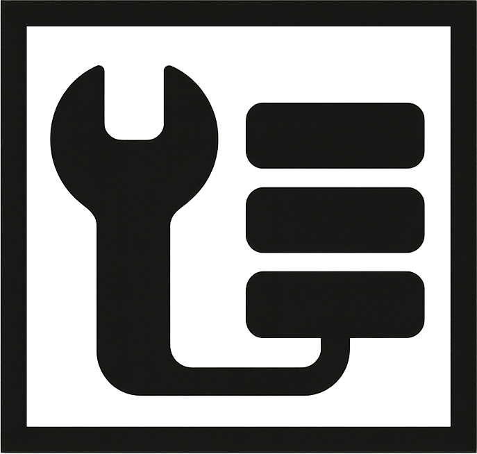

<p align="center">
  
</p>

# TVCache: Accelerating Agent Training with Tool Call Graphs

This repository contains TVCache and an end-to-end training example that demonstrates its use. TVCache speeds up RL training of tool-using agents by caching tool execution results in a **Tool Call Graph (TCG)**. TCG is a prefix tree of tool call sequences that enables reuse across rollouts and epochs.

## Repository Structure

```
├── tvcache/            # TVCache server and client library
│   ├── server/         # HTTP server that maintains the TCG
│   └── client/         # Python client (tvclient) for integrating TVCache into training loops
├── train/              # Example: Video QA agent trained with Tinker API
└── video-agent-tools/  # Video sandbox server (tool execution backend for the example)
```

## Quick Start

### 1. Start the TVCache server

```bash
cd tvcache/server
uv sync
uv run tvcache_server.py    # http://localhost:8000
```

See the [server README](tvcache/server/README.md) for API details and configuration.

### 2. Start the tool execution backend

The example uses a video analysis sandbox. See the [video-agent-tools README](video-agent-tools/VideoAgent/README.md) for setup.

### 3. Install dependencies and run training

```bash
cd train
uv sync
uv pip install -e ../tvcache/client   # install tvclient
```

Set your Tinker API key in `run.sh`, then:

```bash
./run.sh train_with_tvcache.py
```

See the [training README](train/README.md) for dataset preparation and configuration. See the [integration guide](train/integration.md) for how to integrate `tvclient` into your own training loop.

## Components

| Component | What it does | README |
|---|---|---|
| **TVCache server** | Maintains the TCG, handles prefix matching, environment locking, and pruning | [tvcache/server](tvcache/server/README.md) |
| **tvclient** | Python library: `ToolCall`, `ToolCallEnv`, `AsyncSemanticStatefulExecutor` | [tvcache/client](tvcache/client/README.md) |
| **train** | Video QA RL training with Tinker API (three variants: no cache, stateless dict cache, TVCache) | [train](train/README.md) |
| **video-agent-tools** | Sandbox server wrapping VideoAgent (ECCV 2024) for video analysis tools | [video-agent-tools/VideoAgent](video-agent-tools/VideoAgent/README.md) |
