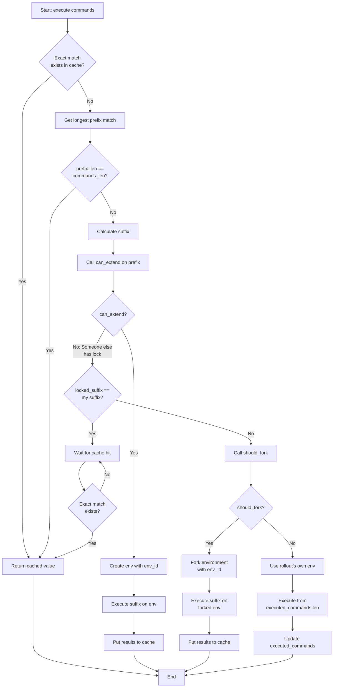

# Command Execution Flow

```mermaid
graph TD
    A[Start: execute commands] --> B{Exact match<br/>exists in cache?}

    B -->|Yes| C[Return cached value]
    C --> Z[End]

    B -->|No| D[Get longest prefix match]

    D --> E{prefix_len ==<br/>commands_len?}
    E -->|Yes| C

    E -->|No| F[Calculate suffix]
    F --> G[Call can_extend on prefix]

    G --> H{can_extend?}

    H -->|Yes| I[Create env with env_id]
    I --> J[Execute suffix on env]
    J --> K[Put results to cache]
    K --> Z

    H -->|No: Someone else<br/>has lock| L{locked_suffix ==<br/>my suffix?}

    L -->|Yes| M[Wait for cache hit]
    M --> N{Exact match<br/>exists?}
    N -->|No| M
    N -->|Yes| C

    L -->|No| O[Call should_fork]
    O --> P{should_fork?}

    P -->|Yes| Q[Fork environment<br/>with env_id]
    Q --> R[Execute suffix on<br/>forked env]
    R --> S[Put results to cache]
    S --> Z

    P -->|No| T[Use rollout's own env]
    T --> U[Execute from<br/>executed_commands len]
    U --> V[Update executed_commands]
    V --> Z
```